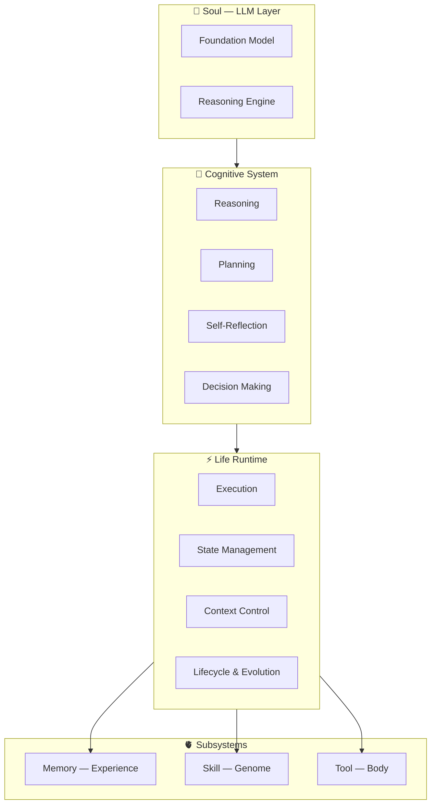

# Tiangong Origin

> **AI Engineering Lifeform Runtime**
> An open-source infrastructure exploring the evolution of AI from intelligent tools into continuously evolving engineering lifeforms.

<p align="center">
  <b>LLM as Soul · Agent as Body · Runtime as Neural System · Memory as Experience · Skill as Genome · Tool as Organs</b>
</p>

<p align="center">
  <a href="#overview">Overview</a> •
  <a href="#core-philosophy">Philosophy</a> •
  <a href="#architecture">Architecture</a> •
  <a href="#core-systems">Systems</a> •
  <a href="#roadmap">Roadmap</a> •
  <a href="#contributing">Contributing</a>
</p>

---

## Overview

Tiangong Origin is an open-source AI engineering lifeform infrastructure.

Unlike traditional AI Agent frameworks that focus on **task execution**, Tiangong explores a new paradigm:

**Building AI systems that can persist, learn, create capabilities, reflect on themselves, and continuously evolve.**

### From Tools to Lifeforms

**Traditional AI:**

```text
User → Prompt → LLM → Response
```

**Tiangong:**

```text
             Soul
              |
              v
      Cognitive System
              |
              v
        Life Runtime
              |
    +---------+---------+
    |         |         |
    v         v         v
 Memory     Skill      Tool
Experience  Genome     Body
```

The goal is to build AI entities with a **complete engineering life cycle**—not just answer questions, but grow, adapt, and evolve.

---

## Core Philosophy

### AI is not only a tool

Most current AI systems are designed as:

```text
Input → Processing → Output
```

Tiangong explores:

```text
Perception
    ↓
Understanding
    ↓
Experience
    ↓
Capability Growth
    ↓
Self Improvement
```

An AI system should be able to:

- **Remember** — retain and utilize experience
- **Learn** — acquire new knowledge from interaction
- **Adapt** — adjust to changing environments
- **Create** — generate new capabilities
- **Improve** — optimize itself over time

---

## Architecture



---

## Core Systems

### 1. Life Runtime

The **nervous system** of Tiangong.

- Agent lifecycle management
- Task execution & state management
- Context management & recovery
- Evolution process control

### 2. Memory System

Memory is not conversation storage. It is the **accumulated experience** of an AI entity.

- Working memory & long-term memory
- Experience extraction & rule formation
- Knowledge evolution over time

### 3. Skill Genome System

Skills are not simple prompts. A Skill is a **reusable capability genome**:

```text
Knowledge + Methodology + Tools + Experience + Validation Rules
```

Skills can **combine, improve, evolve, and generate new capabilities**.

### 4. Digital Body System

Tools are not just API calls. They are the **organs** that allow AI to interact with the world.

| Component | Function |
|-----------|----------|
| File System | Environment interaction |
| Code Runtime | Creation capability |
| Database | Information access |
| Enterprise API | Business operation |

### 5. Ability System

Ability is the emergent combination of:

```text
Memory + Skill + Tool + Runtime
```

**Example:** A Legal Assistant Ability = Legal Skill + Law Database Tool + Case Memory + Reasoning Runtime

### 6. Safety Gate

Autonomous systems require controlled boundaries.

| Level | Description |
|-------|-------------|
| A0 | Automatic execution |
| A1 | Low-risk execution |
| A2 | Controlled execution |
| A3 | Audited execution |
| A4 | Human approval required |
| A5 | Forbidden automation |

---

## Why Tiangong?

| | Traditional Agent | Tiangong Origin |
|---|-------------------|-----------------|
| **Goal** | Complete tasks | Develop capabilities |
| **Runtime** | Workflow engine | Life runtime |
| **Memory** | Context storage | Experience system |
| **Skill** | Prompt template | Capability genome |
| **Tool** | API plugin | Digital organ |
| **Upgrade** | Developer update | Continuous evolution |
| **Existence** | Temporary session | Persistent entity |

---

## Current Status

### Implemented / Exploring
- [x] Agent Runtime architecture
- [x] Memory architecture
- [x] Skill system
- [x] Tool ecosystem
- [x] Safety control system
- [x] Enterprise AI Agent scenarios

### Research Areas
- Self-improving AI systems
- Long-term AI operation
- Capability evolution
- AI-native organizations

---

## Roadmap

### Phase 1: Runtime Foundation
- [x] Agent execution engine
- [x] Tool management
- [x] Memory foundation
- [ ] Skill framework

### Phase 2: Engineering Lifeform
- [ ] Self evaluation
- [ ] Capability evolution
- [ ] Experience accumulation
- [ ] Autonomous optimization

### Phase 3: AI Native Organization
- [ ] Multi-agent ecosystem
- [ ] AI employees
- [ ] Autonomous production systems

---

## Open Source Vision

Tiangong Origin is not another chatbot framework.

It is an exploration of a fundamental question:

> **Can software evolve from static programs into continuously growing intelligent systems?**

Future software may have memory, experience, capability, adaptation, and evolution.

Tiangong Origin aims to provide an open foundation for this future.

---

## Contributing

We welcome developers, researchers, and AI builders interested in:

- Agent Runtime
- AI Architecture
- Memory Systems
- Capability Engineering
- Autonomous AI Systems

Join us in building the next generation of intelligent software.

---

## License

Coming soon.
